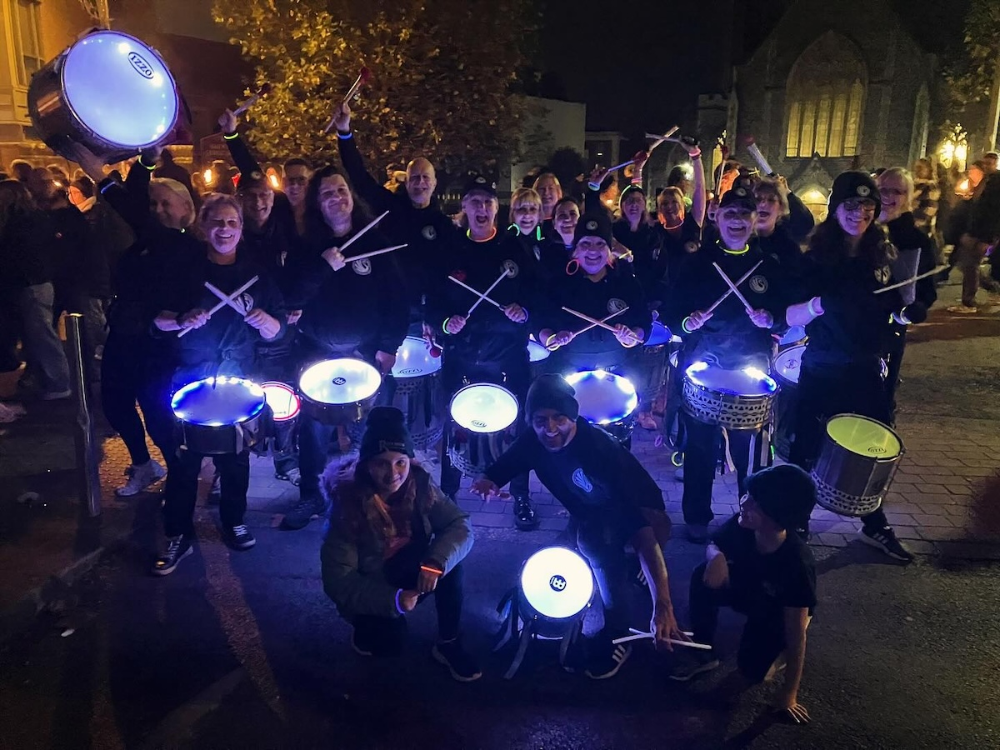
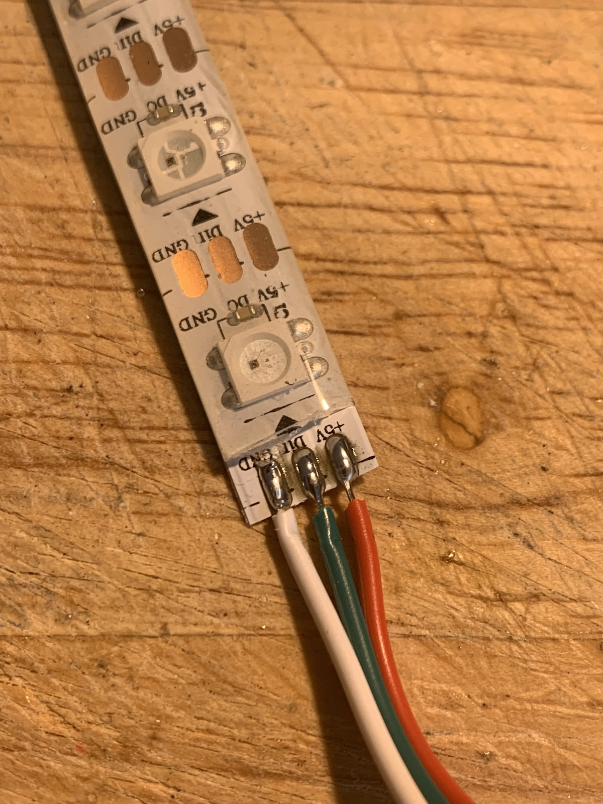
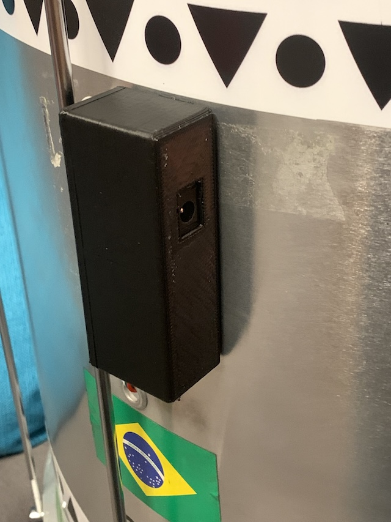

# Drum Lights

## About

This project provides synchronised, colour-changing, remote-control LED lights for a drum band (but could be used for other similar applications). It was first created for [Swan Samba](https://www.swansamba.co.uk) to use for evening/winter performances.

Hundreds of hours have gone into developing this project - if you make use of it and wish to thank me, then please consider a donation;

Contributions to improve this documentation or code would also be very welcome to help other users.

## Skills & Requirements

This is a technically complex project! Whilst I've partly documented it here, to use it successfully you'll need to improvise a bit and will need some experience with;

- sourcing and assembling the electronic components (eg from AliExpress), including soldering techniques

- building and uploading the firmware using [Visual Studio Code](https://code.visualstudio.com/) and [PlatformIO](https://platformio.org/)

- 3D-printing for the enclosure boxes

If you are not confident with these skills, then this probably isn't the project for you; I'm happy to answer the odd question, but this project is provided 'as-is' and as a hobby I'm unable to provide extensive support, sorry!

## Overview

The system consists of two components;

- Transmitter (TX) - provides a web-based interface to select required colours/patterns, and broadcasts a radio signal to the receivers.

- Receiver (RX) - receives the broadcast radio signal and drives a strip of individually-addressable LED pixels mounted inside the shell of each drum.

Both are powered by portable USB battery packs ('power banks'), typically carried in a pocket by each band member (or could be mounted to each drum).

## Transmitter

The transmitter (TX) consists of an ESP32 dev-kit board plus a RF24-based radio module, mounted on proto-board.

Although the RF24 modules use the 2.4Ghz ISM radio band, they are not WiFi (which is available on the ESP32 already); this was chosen for low-latency and avoiding the need for a network router for a large number of receivers (which would not be able to connect simultaneously to the ESP32 hotspot).

Significantly better results have been found with the E01-2G4M27D module, rather than the cheaper basic nRF24L01-PA-LNA which suffers RF interference and instability.

The ESP32 also broadcasts a WiFi personal hotspot (configured as a captive portal) to allow a user who wants to control the display to connect simply from their mobile phone.

It runs an AsyncWebServer serving a simple HTML/CSS/JS page from a filesystem, with control commands received by websocket (allowing simultaneous control from multiple clients if required).

The RF24 module uses a configurable transmit power with multiple channels available, but does not avoid packet collision with other sources using the same frequency. For this reason we retransmit each command multiple times in quick succession, in the hope that 'one gets through'. It also requires a stable 3.3v supply, which at high-power transmission could exceed that available from the ESP32, so a separate buck converter is used fed from the power supply.

## Receiver

The receiver (RX) consists of an ESP8266-based Wemos D1-mini clone board, plus a RF24 module, mounted on a PCB.

Better reliability has been found with the E01-ML01DP4 module, rather than the cheaper basic nRF24L01. 

It receives radio commands from the TX and uses these to drive a strip of WS2812B LEDs ("neopixels") using the excellent [FastLED](https://fastled.io) library.

Best-practice often requires the use of a 3.3v level-shifter and/or resistor in the data line, but testing showed this not to be neccessary, probably given the short data-line length, although a capacitor _is_ provided on the power supply (although as a DC source, USB battery packs are probably sufficiently stable already). 

The receiver reads a configuration file with the number of LEDs available in the attached strip, and uses this to dynamically compute moving effects to suit the varying drum sizes within a band. This file should be uploaded to the filesystem on each board.

## LED mounting

Self-adhesive IP65 WS2812B LED strip is mounted inside the shell of each drum, approx a quarter of the way from the top, around the full circumference. 

The strip requires 3-core cable: 5V, data and ground;

Ensure this is sealed with silicone or hot-glue to prevent water ingress, and insulated with heatshrink;

The cable exits through the sound hole/port and runs to an enclosure holding the RX board.

## Enclosures

Both RX and TX are mounted in custom 3D-printed boxes; the RX in particular is designed to secure the components against vibration. Power is supplied via a 5.5mm DC jack using a [USB cable](https://www.kenable.co.uk/en/usb-cables-adapters/usb-20-cables/usb-20-adapters/7629-usb-to-dc-power-cable-usb-20-for-21mm-x-55mm-5v-2a-2000ma-1m-007629-5055383476299.html).

Experience has shown it's best to mount the RX on the *rear* of all drums with 3M VHB double-sided tape. Ensure the TX is positioned at the rear of the band too, to avoid metal-shelled drums blocking the RF signal. _Ensure players know this to mount their drum accordingly!_

## PCBs

After breadboard prototyping, initial builds were built on protoboard but for more than a small handful of boards (which require plenty of soldering!), it's advisable to consider custom-printed PCBs. 

[Design files are provided](PCB/) for [KiCAD](https://www.kicad.org/) with Gerber output files ready for use at [JLCPCB](https://jlcpcb.com/).

## Effects

The lighting patterns currently available are;

- Static: every pixel the same colour, available in various colours.
- Chase: 4 quadrants of moving pixels with a fading 'tail', rotating around the drum, available in various colours.
- Twinkle: a number of pixels randomly light then fade, available in various colours.
- Fire: a 'flickering' flame effect in varying colours.
- 'Rio Spin': 3 segments of solid colour (blue/green/yellow) rotating around the drum.
- 'Rio Disco': twinkle, with blue/green/yellow only.
- 'Rio Flag': a blue/green/yellow sequence representing the Brazilian flag, rotating around the drum.
- Rainbow: a classic FastLED multi-colour effect, rotating around the drum.
- Hazards: 2 segments of orange at the side of each drum, designed to imitate a vehicle's hazard lights when stopped.
- Strobe: rapid, short-duration flashes of full-intensity white - perfect for big hits!
- 999: alternate high-frequency flashing blue strobes (named after the UK emergency-services telephone number).
- Auto: randomises most of the above every 30s; ideal to 'fire-and-forget' if no-one is available to run the show.

Many of the FastLED demo effects suit 1D (strip) or 2D (panel) setups; the circular/ring configuration here does present some additional challenges, but further effects are really only limited by imagination (although compexity of the control UI should be considered).

## Synchronicity

Currently, all drums receive the same command and hence display the same colour/pattern at the same time. The speed of the rotating patterns (ie RPM) is not synchronised across varying diameter drums; early experiments showed this to be hard to maintain a smooth frame rate at slower speeds (on smaller drums); temporal dithering may help this.

It would be relatively simple to use addressing or channel features of the RF24 to control each drum type seperately, allowing complex displays and patterns 'across' the band. The main obstacle is likely to be the complexity of the control UI.